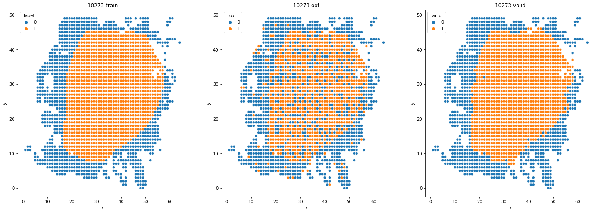

# comp_breast
## 今回のやったこと
画像は50×50を結合させず、モデルごとにresizeして適用
モデルごとに異なるが、128×128で基本的に使用した。

後処理
いくつかのモデルの結果を平均、logistic、LightGBMの3手法でアンサンブル
この時点で閾値0.5以上はとりあえず陽性

x,y座標のユークリッド距離を求めて、knnで近傍点をK個抽出
陽性の数の割合が、閾値以上あれば陽性(1)、そうでなけば陰性(0)とした。
Kや閾値は、validationデータで最適な値を求めた（K=13, th=0.4）
  
(左:正解 中:knnの後処理前 右:knnの後処理後)

### 学習させてみたモデル
* Vision Transformer (resnetのハイブリッド版も使用)
* Efficientnet_b2~b4
* nfnet_f0~1(推論結果は提出に間に合わず)
* efficientnetv2(推論結果は提出に間に合わず)

### 最終提出に使用したモデル
* Vision Transformer (vit_base_patch16_224) 
efficientnetとのアンサンブルは単体より精度が低くなったのでやめました 
